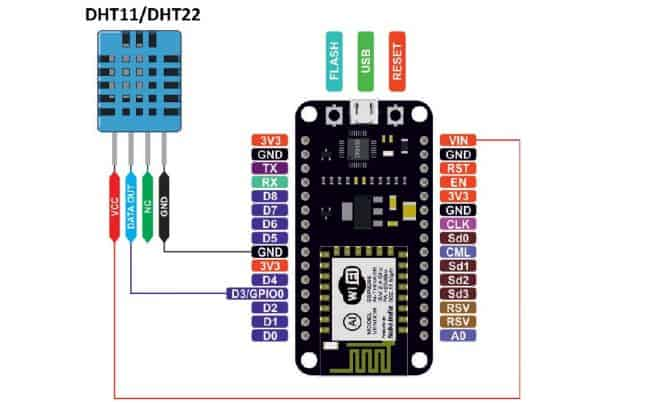

# Teste de Software Embarcado

Sistemas embarcados são uma parte crucial do nosso mundo moderno, presente em dispositivos como automóveis, eletrodomésticos, dispositivos médicos, smartphones e sistemas de automação. Esses sistemas têm uma característica especial: o software precisa ser altamente confiável, eficiente e otimizado para funcionar em conjunto com hardware específico, muitas vezes com recursos limitados. O **teste de software embarcado** é essencial para garantir a qualidade, confiabilidade e segurança desses sistemas.

## Introdução

No desenvolvimento de sistemas embarcados, como aqueles baseados em microcontroladores como o **ESP8266** ou **ESP32**, é crucial garantir que os diferentes componentes de hardware e software funcionem corretamente em conjunto. Para isso, os **testes de integração** desempenham um papel fundamental, verificando a interação entre os módulos de software e hardware. O **PlatformIO** é uma poderosa ferramenta de desenvolvimento integrada que facilita a automação e execução de testes para microcontroladores, fornecendo suporte para diferentes plataformas e frameworks.


## O que é Software Embarcado?

Software embarcado é um programa ou conjunto de programas projetados para controlar dispositivos eletrônicos. Diferentemente de software de aplicação geral, como os encontrados em computadores e smartphones, o software embarcado é geralmente especializado para realizar uma função específica, em tempo real, e diretamente acoplado ao hardware.

Exemplos de sistemas embarcados incluem:

- **Microcontroladores** em sistemas de automação residencial.
- **ECUs** (Electronic Control Units) em veículos automotores.
- **Dispositivos IoT (Internet das Coisas)** que se comunicam via redes sem fio para monitorar e controlar dispositivos.

Devido à criticidade de muitos desses sistemas, como em aplicações médicas ou aeroespaciais, o processo de teste de software embarcado deve ser meticuloso e abrangente.

## Desafios no Teste de Software Embarcado

Testar software embarcado envolve desafios específicos que o diferenciam do teste de software tradicional:

1. **Conformidade com hardware específico**: O software é projetado para hardware com características únicas (microcontroladores, sensores, atuadores), exigindo que o teste seja feito diretamente no dispositivo ou em simuladores precisos.
2. **Restrições de tempo real**: Muitos sistemas embarcados têm requisitos de tempo real que precisam ser respeitados, o que significa que as respostas do sistema devem ocorrer dentro de prazos muito curtos.
3. **Recursos limitados**: Dispositivos embarcados costumam ter restrições de memória, energia e processamento, tornando o software mais complexo e difícil de testar.
4. **Segurança e Confiabilidade**: Em muitos casos, falhas em sistemas embarcados podem ter consequências severas, como no caso de dispositivos médicos ou sistemas automotivos.

## Tipos de Testes de Software Embarcado

### 1. **Testes Funcionais**

Os testes funcionais têm como objetivo verificar se o software embarcado está operando conforme as especificações do projeto. Eles asseguram que todas as funções implementadas pelo software sejam executadas corretamente, e incluem:

- **Teste de entrada e saída (I/O)**: Verifica se o software está recebendo e processando dados corretamente dos sensores e atuadores.
- **Teste de controle de hardware**: Avalia se o software está controlando corretamente o hardware, como motores, LEDs, displays, etc.

### 2. **Testes de Integração**

Os **testes de integração** verificam a interação entre diferentes componentes do sistema para garantir que eles funcionem corretamente quando combinados. Ao contrário dos testes unitários, que focam em funções ou módulos isolados, os testes de integração avaliam o comportamento do sistema como um todo, incluindo o hardware e suas interfaces.

No contexto de sistemas embarcados, isso pode significar testar:

- Comunicação entre o microcontrolador e sensores (ex.: via **I2C**, **SPI** ou **UART**).
- Envio de dados para servidores ou APIs na nuvem.
- Integração de diferentes bibliotecas de software.
- Funcionamento adequado de periféricos (displays, LEDs, motores, etc.).


### 3. **Testes de Performance**

Testes de performance são essenciais para avaliar o comportamento do software sob diferentes condições. Para sistemas embarcados, isso pode incluir:

- **Consumo de energia**: Verificar o consumo de energia do software em diferentes modos operacionais (ativo, stand-by, sleep).
- **Tempo de resposta**: Avaliar se o software consegue responder em tempo hábil a eventos críticos, respeitando os requisitos de tempo real.
- **Uso de memória**: Garantir que o software embarcado não exceda as limitações de memória do dispositivo, o que pode causar falhas ou instabilidade.

### 4. **Testes de Estresse**

Os testes de estresse avaliam como o software se comporta em condições extremas ou fora dos parâmetros normais de operação. Isso pode incluir:

- **Carga máxima de dados**: Testar como o sistema lida com uma quantidade excessiva de dados.
- **Condicionamentos ambientais extremos**: Simular temperaturas, umidade ou vibrações para garantir que o software funcione corretamente quando o hardware está submetido a condições adversas.

### 5. **Testes de Segurança**

Com a crescente conectividade dos sistemas embarcados, especialmente em dispositivos IoT, a segurança tornou-se um aspecto crítico. Testes de segurança visam identificar vulnerabilidades no software que possam ser exploradas por atacantes. Isso pode incluir:

- **Testes de autenticação**: Verificar se o software implementa corretamente os mecanismos de autenticação para impedir acessos não autorizados.
- **Análise de vulnerabilidade**: Avaliar o software quanto a possíveis falhas de segurança, como buffer overflow ou ataques de injeção.

### 6. **Testes de Regressão**

Sempre que o software é atualizado, é crucial garantir que as funcionalidades existentes não sejam comprometidas. Os testes de regressão verificam se novas modificações no código introduziram erros nas funcionalidades que já estavam operando corretamente.

### 7. **Testes de Confiabilidade**

Em sistemas embarcados, é comum que os dispositivos operem por longos períodos sem intervenção humana. Os testes de confiabilidade verificam se o software pode funcionar de forma contínua por períodos prolongados sem falhas. Isso é feito por meio de testes de longa duração ou de reinicializações periódicas para verificar a capacidade do sistema de se recuperar de falhas.

### 8. **Testes de Usabilidade (se aplicável)**

Para sistemas embarcados que possuem interface com o usuário, como dispositivos vestíveis ou painéis de controle, os testes de usabilidade são importantes para garantir que o sistema seja intuitivo e fácil de usar.

## Configurando o Ambiente de Testes com PlatformIO

O **PlatformIO** pode ser instalado como uma extensão no **Visual Studio Code** ou diretamente pela linha de comando. A instalação pode ser feita via **pip**:

```bash
pip install platformio
```

Após a instalação, crie um novo projeto utilizando o comando:

```bash
platformio init --board esp12e  # ou outra placa específica que você esteja utilizando
```

Isso criará a estrutura básica do projeto, incluindo o arquivo de configuração `platformio.ini`.

### 2. Estrutura de Testes no PlatformIO

No PlatformIO, os testes de integração são escritos em uma pasta chamada `test/` dentro do seu projeto. Cada subpasta em `test/` representa um conjunto de testes. O código de teste pode ser implementado usando bibliotecas como **Unity**, que o PlatformIO oferece como padrão.

A estrutura básica de um projeto de testes de integração seria algo como:

```bash
project/
|-- src/
|   |-- main.cpp       # Código principal do projeto
|-- test/
|   |-- test_integration/
|       |-- test_integration.cpp  # Código de teste de integração
|-- platformio.ini     # Arquivo de configuração do PlatformIO
```

### 3. Exemplo de Teste de Integração com Sensores (DHT11 & LDR)



Vamos criar um exemplo simples de teste de integração com o sensor **DHT11** & **LDR**, que mede temperatura e umidade.

1. Adicione a biblioteca do DHT ao projeto:

   ```
   platformio lib install "DHT sensor library"
   ```

2. Crie um arquivo de teste em `test/test_integration/test_integration.cpp`:

```cpp
#ifdef UNITY_TEST

#include <Arduino.h>
#include <unity.h>
#include <DHT.h>

#define DHTPIN 3      // Pino do sensor DHT11
#define DHTTYPE DHT11 // Tipo do sensor
#define LDRPIN A0 //Atribui A0 a variável ldr

DHT dht(DHTPIN, DHTTYPE);

// Teste para verificar se a leitura de umidade é válida
void test_humidity_reading() {
    float hum = dht.readHumidity();
    TEST_ASSERT(hum >= 0 && hum <= 100);  // Umidade válida (0-100%)
}

// Teste para verificar se a leitura de temperatura é válida
void test_temperature_reading() {
    float temp = dht.readTemperature();
    TEST_ASSERT(temp >= -40 && temp <= 125);  // Temperatura válida para o DHT11
}

// Teste para verificar se a leitura de luminosidade é válida
void test_luminosidade_reading() {
lumiz = analogRead(LDRPIN);
    TEST_ASSERT(lumiz >= 300 && lumiz <= 500);  // luminosidade válida para o LDR
}

void setup() {
    // Inicializa o sensor
    dht.begin();

    // Inicia o Unity (framework de testes)
    UNITY_BEGIN();

    // Executa os testes
    RUN_TEST(test_luminosidade_reading);
    RUN_TEST(test_temperature_reading);
    RUN_TEST(test_humidity_reading);

    // Finaliza o Unity
    UNITY_END();
}

void loop() {
    // Não é necessário um loop para testes simples
}

#endif
```

Esse exemplo simples faz a leitura de luminosidade do sensor LDR e temperatura e umidade do sensor DHT11 e verifica se os valores estão dentro dos limites esperados.

1. Configure o arquivo `platformio.ini` para incluir as bibliotecas necessárias e habilitar o suporte a testes:

```.env
[env:esp12e]
platform = espressif8266
board = nodemcuv2
framework = arduino
lib_deps = DHT sensor library
board_build.mcu = esp8266
test_build_src = true  # Inclui o código principal nos testes
monitor_speed = 115200
upload_port = /dev/ttyUSB0
```

### 4. Executando os Testes

Para rodar os testes de integração, execute o seguinte comando no terminal:

```bash
platformio test
```

Isso compilará o projeto e enviará os testes para o dispositivo ESP8266 (ou qualquer microcontrolador especificado), e exibirá os resultados dos testes diretamente no terminal.

## Conclusão

O **PlatformIO** facilita a configuração e execução de testes de integração em sistemas embarcados, permitindo que os desenvolvedores validem a interação entre o hardware e o software de forma automatizada. Com suporte a bibliotecas como **Unity** para testes automatizados, o processo de desenvolvimento torna-se mais ágil e confiável.

Implementar testes de integração garante que o sistema funcione corretamente em diferentes cenários, incluindo o uso de periféricos, comunicação com sensores e conectividade com serviços em nuvem. Além disso, a integração desses testes em pipelines de **Integração Contínua (CI)** melhora significativamente a qualidade do código e a eficiência do processo de desenvolvimento.


## Apresentação
[Apresentação](https://docs.google.com/presentation/d/1u67xNJGF7r4R6tMp2r5eKKtOG_8oahwVlN3QH1VkzrU/edit?usp=sharing)
